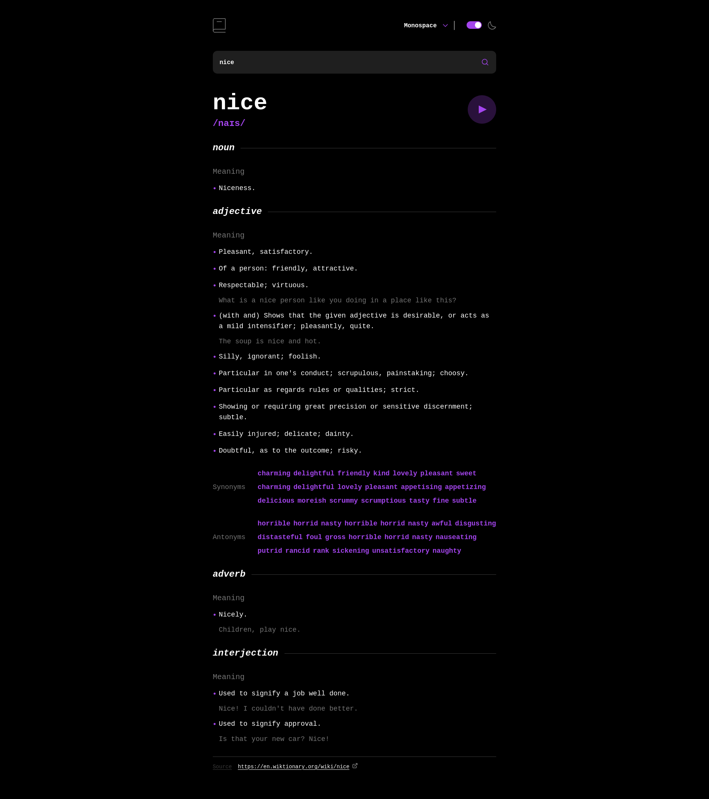
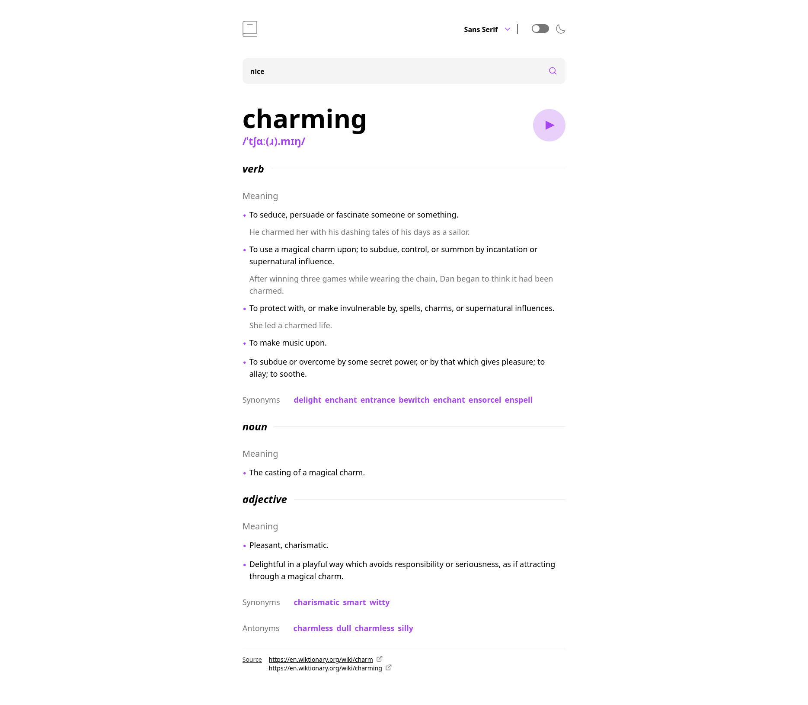

# Frontend Mentor - Dictionary Web App solution

This is a solution to the [Dictionary Web App challenge on Frontend Mentor](https://www.frontendmentor.io/challenges/dictionary-web-app-h5wwnyuKFL). Frontend Mentor challenges help you improve your coding skills by building realistic projects.

## Table of contents

- [Overview](#overview)
  - [The challenge](#the-challenge)
  - [Screenshot](#screenshot)
  - [Links](#links)
- [My process](#my-process)
  - [Built with](#built-with)
  - [What I learned](#what-i-learned)
  - [Continued development](#continued-development)
  - [Useful resources](#useful-resources)

## Overview

### The challenge

Users should be able to:

- Search for words using the input field
- See the Free Dictionary API's response for the searched word
- See a form validation message when trying to submit a blank form
- Play the audio file for a word when it's available
- Switch between serif, sans serif, and monospace fonts
- Switch between light and dark themes
- See hover and focus states for all interactive elements on the page

### Screenshot





### Links

- Live Site URL: [Live Preview](https://azanra.github.io/dictionary-web-app/)

## My process

### Built with

- [React](https://reactjs.org/) - JS library
- [Dictionary API](https://dictionaryapi.dev/) - Dictionary API

### What I learned

The custom hooks for this function is different from the one that i used to create. first the hooks itself will be used only when the form is submitted, not when the component is rendered on the pages. that why it return the fetch function instead of running it on the use effect hooks.

```js
const useGetDictionary = () => {
  const [data, setData] = useState(initialData);
  const [error, setError] = useState(null);
  const [isLoading, setIsLoading] = useState(false);

  const fetchDictionary = async (keyword) => {
    try {
      setIsLoading(true);
      const response = await fetch(
        `https://api.dictionaryapi.dev/api/v2/entries/en/${keyword}`,
      );
      const result = await response.json();
      const [firstResult] = result;
      console.log(result);
      setData(firstResult);
      setError(null);
    } catch (error) {
      setError(error);
    } finally {
      setIsLoading(false);
    }
  };

  return {
    data,
    error,
    isLoading,
    fetchDictionary,
  };
};
```

because of this, the loading will be initialized to false, because it's not running the fetch immediately, but wait for the user to submit the form. the loading state will not be immediately updated to true, but later on when the await response arrive. this might trigger unnecessary rerender, might need to double check this.

Also at first i try to call the fetch function on Input element, and the rest of the state on App level. but i forgot that each hooks call is not the same, they only share the logic, not the state itself, that's why the data is not updated when fetching with Input level fetch function. The proper solution is to retrieve it on App level, and pass the fetch function as a props on to the Input element.

```js
function App() {
 //....
  const { data, error, isLoading, fetchDictionary } = useGetDictionary();  return (
    //...
  )
}
```

And for the font dropdown, i need to create three different section, which is the dropdown parent, where it will hold all the state and will be passed as context so that it can be consumed by it children, the dropdown trigger which will trigger whether to show the dropdown or not, the dropdown menu item is the container of the dropdown, and dropdown menu items is each individually selectable item that rendered in the dropdown menu.

```js
<Dropdown>
  <DropdownTrigger>
    <div className="flex items-center border-r-1">
      <p className="font-bold">{currentFont}</p>
      <div className="mx-[16px]">
        <ArrowDown />
      </div>
    </div>
  </DropdownTrigger>
  <DropdownMenuItem>
    {fonts.map((font) => {
      return (
        <DropdownMenuItems key={font} onClick={() => setCurrentFont(font)}>
          <p
            className={`${dictionaryUtils.getCurrentFont(
              font,
            )} font-bold py-[8px] hover:text-(--purple)`}
          >
            {font}
          </p>
        </DropdownMenuItems>
      );
    })}
  </DropdownMenuItem>
</Dropdown>
```

For the close the dropdown on outside click, it use hooks where it will add an event listener on to the dropdown div, and it will check if the event it came from is not a children of the div (mean it not inside the dropdown) and close the dropdown.

```js
const useClickOutside = (ref, onClickOutside) => {
  useEffect(() => {
    const onClick = (e) => {
      if (ref.current && !ref.current.contains(e.target)) {
        onClickOutside();
      }
    };
    document.addEventListener("click", onClick);
    return () => document.removeEventListener("click", onClick);
  }, [ref, onClickOutside]);
};
```

if any of the dependency (ref and event handler(which is stable because react guarantee state setter to be stable)) it will remove the existing event on existing element before adding a new event to the new element.

And for the warning message if the keyword is empty on form submit, i can't
figure it out with existing state, because the fetch function itself wouldn't be called if it's empty, and the state data, loading, and error can't be used as a flag, that why i create a new state, which will be updated on form submit, adn the value will be decide if it valid or not depending on the keyword length.

```js
const Input = ({ keyword, setKeyword, fetchDictionary }) => {
  const [isValid, setIsValid] = useState(true);
  const isDark = useContext(IsDarkContext);

  const handleSubmit = () => {
    if (keyword.length > 0) {
      fetchDictionary(keyword);
      setIsValid(true);
    } else {
      setIsValid(false);
    }
  };
  return (
    <div>
      <form action={handleSubmit}>
        <div className="flex relative">
          <input
            type="text"
            name="keyword"
            id="keyword"
            value={keyword}
            onChange={(e) => setKeyword(e.target.value)}
            className={`${
              isDark ? "bg-[#1f1f1f]" : "bg-[#f4f4f4]"
            } flex-1 flex rounded-xl p-[16px] font-bold border-2 border-transparent focus:border-(--purple) focus:outline-none`}
          />
          <button
            type="submit"
            className="absolute right-5 inset-y-0 cursor-pointer"
          >
            <IconSearch />
          </button>
        </div>
        {!isValid && (
          <p className="text-red-500 ml-[8px] mt-[8px]">
            Whoops, can't be empty...
          </p>
        )}
      </form>
    </div>
  );
};
```

### Continued development

- Convert it to typescript

(Convert to typescript)[https://github.com/azanra/dictionary-web-app/pull/1]

Adding type to props component and convert existing context to context provider and consumer pattern

```js
import { createContext, useContext } from "react";
import useGetDictionary from "./useGetDictionary";
import type { IDictionaryContext } from "../interfaces/dictionaryInterface";

const DictionaryContext = createContext<IDictionaryContext | undefined>(
  undefined,
);

const DictionaryProvider = ({ children }: { children: React.ReactNode }) => {
  const { data, error, isLoading, fetchDictionary } = useGetDictionary();

  return (
    <DictionaryContext value={{ data, error, isLoading, fetchDictionary }}>
      {children}
    </DictionaryContext>
  );
};

const useDictionary = () => {
  const context = useContext(DictionaryContext);
  if (!context) {
    throw new Error("useDictionary must be used within a DictionaryProvider");
  }

  return context;
};

export { DictionaryProvider, useDictionary };
```

To provide and consume the data would be like this

```js
const HomeWrapper = () => {
  return (
    <DictionaryProvider>
      <Home />
    </DictionaryProvider>
  );
};

export default HomeWrapper;
```

Wrapper is used so that home component can consume the data immediately, by setting it as default export we can call the HomeWrapper component and rename it to Home instead.

```js
const Home = () => {
  const { data, error, isLoading } = useDictionary();
  const { fontFamily } = useFont();

  const isNotLoading = !data || error ? <Error /> : <Body />;

  return (
    <div
      className={`${fontFamily} bg-(--neutral-0) text-(--neutral-800) dark:bg-(--neutral-950) dark:text-(--neutral-0) flex justify-center items-center`}
    >
      <div className="min-h-screen w-full md:max-w-[689px] xxl:max-w-[736px]">
        <Header />
        {isLoading ? (
          <p className="font-bold text-preset-7 text-center py-[24px]">
            Loading...
          </p>
        ) : (
          isNotLoading
        )}
      </div>
    </div>
  );
};
```

To check user theme preference, we can use `prefers-color-scheme`, and access it through `window.matchMedia`.
to use dark mode in tailwind first declare `@custom-variant dark (&:where(.dark, .dark *))`, it will check in the `root` element whether `dark` class is present, if it is then use dark theme else use default theme.

```js
const ThemeProvider = ({ children }: { children: React.ReactNode }) => {
  const [theme, setTheme] = useState<IThemeContext["theme"]>("light");

  const handleUpdateTheme = (currentTheme: IThemeContext["theme"]) => {
    localStorage.setItem("theme", currentTheme);
    document.documentElement.classList.remove("light", "dark");
    document.documentElement.classList.add(currentTheme);
    setTheme(currentTheme);
  };

  useEffect(() => {
    const localTheme = localStorage.getItem("theme") as "light" | "dark" | null;
    const systemTheme = window.matchMedia("(prefers-color-scheme: dark)")
      .matches
      ? "dark"
      : "light";

    const currentTheme = localTheme ?? systemTheme;

    document.documentElement.classList.remove("light", "dark");
    document.documentElement.classList.add(currentTheme);
    setTheme(currentTheme);
  }, []);

  return (
    <ThemeContext value={{ theme, setTheme: handleUpdateTheme }}>
      {children}
    </ThemeContext>
  );
};
```

To make it explicit component is part of it parent, we can use dot notation to group component together

```js
const Dropdown = ({ children }: { children: React.ReactNode }) => {
  const { setIsShown } = useDropdown();

  const refWrapper = useClickOutside<HTMLDivElement>(() => setIsShown(false));

  return (
    <div className="w-fit relative" ref={refWrapper}>
      {children}
    </div>
  );
};

const Trigger = ({ children }: { children: React.ReactNode }) => {
  const { isShown, setIsShown } = useDropdown();

  return (
    <div className="cursor-pointer" onClick={() => setIsShown(!isShown)}>
      {children}
    </div>
  );
};


DropdownWrapper.Trigger = Trigger;
DropdownWrapper.MenuItem = MenuItem;
DropdownWrapper.MenuItems = MenuItems;

export default DropdownWrapper;
```

To access those component is the same as normally accessing children of an object.

```js
      <Dropdown>
        <Dropdown.Trigger>
          <div className="flex items-center gap-[16px] pr-[16px] md:pr-[24px] border-r border-(--neutral-200) dark:border-(--neutral-0) h-[24px] py-[4px]">
            <p className="text-preset-7 font-bold md:text-preset-4">
              {currentFont}
            </p>
            <ArrowDown />
          </div>
        </Dropdown.Trigger>
```

- Replace dictionary API with my own API to ensure uptime

### Useful resources

- [Submit a form with data using a custom React hook](https://stackoverflow.com/questions/65210569/submit-a-form-with-data-using-a-custom-react-hook) - On how creating custom hooks for the form submit
- [How to handle click outside a div in React with a custom hook](https://medium.com/geekculture/how-to-handle-click-outside-a-div-in-react-d2283dc4ed57) - On how to close the dropdown on outside click
- [React wait for fetch data as part of custom hook](https://stackoverflow.com/questions/67822971/react-wait-for-fetch-data-as-part-of-custom-hook) - On how to add loading flag on fetching (im not sure about this one)
- [Dark Mode in React: A Scalable Theme System with Tailwind](https://medium.com/@roman_fedyskyi/dark-mode-in-react-a-scalable-theme-system-with-tailwind-d14e9c1afd1a) - On how to implement dark theme that is scalable
